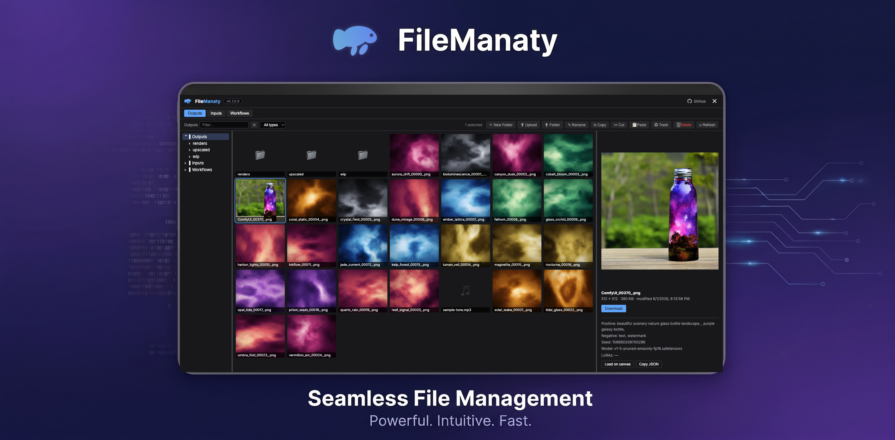

<p align="center">
  
</p>

<h1 align="center">ComfyUI-FileManaty</h1>

<p align="center">
  <strong>El manatí archivador más amable para ComfyUI.</strong><br>
  Un gestor de archivos completo <em>dentro</em> de la interfaz web de ComfyUI: navega, previsualiza, organiza,
  sube, renombra, mueve, copia y elimina archivos de tus raíces de ComfyUI sin necesidad de tocar el sistema operativo del host.
</p>

<p align="center">
  <a href="https://github.com/agarzon/ComfyUI-FileManaty/releases"></a>
  <a href="LICENSE"></a>
  
  <a href="https://wallrus.tech"></a>
</p>

---

## ✨ Características

- 🗂️ **Gestor de archivos tipo Explorador** — un árbol de carpetas, una cuadrícula de miniaturas y un panel de vista previa en vivo, todo en una superposición a pantalla completa con **paneles redimensionables arrastrando** (haz doble clic en un divisor para restablecerlos).
- 🖼️ **Vistas previas ricas** — imágenes en línea, un reproductor de **video** HTML5 y un reproductor de **audio**. Los archivos generados muestran su **resolución** (`1024 × 1024`), tamaño y fecha de un vistazo.
- 🧠 **Visualiza la generación detrás del archivo** — los metadatos integrados de ComfyUI (prompt positivo/negativo, semilla, modelo, LoRAs) se muestran en la vista previa, con un clic para **Copiar JSON** y **Cargar en el lienzo** para colocar el flujo de trabajo directamente en tu gráfico.
- 📤 **Operaciones de escritura completas** — crear carpetas, renombrar, subir (botón o arrastrar desde tu escritorio), copiar/cortar/pegar y mover — dentro y entre raíces.
- ♻️ **Papelera recuperable** — las eliminaciones van a una papelera por raíz desde la que puedes restaurar o vaciar archivos. `Shift+Delete` elimina de forma permanente.
- 🛡️ **Raíces de solo lectura** — monta cualquier raíz en modo solo navegación; el servidor rechaza toda escritura y la barra de herramientas oculta las acciones de escritura.
- 🎨 **Apariencia nativa** — sigue tu tema activo de ComfyUI (claro, oscuro o personalizado) en vivo, mediante los mismos tokens de diseño que usa ComfyUI.
- ⌨️ **Rápido** — navegación por teclado, selección múltiple, arrastrar y soltar, menús contextuales con clic derecho y `Ctrl+Shift+F` para abrir.
- 🔒 **Seguro por diseño** — cada ruta está restringida a tus raíces configuradas a nivel de servidor (sin `..`, sin rutas absolutas, sin escapes de enlaces simbólicos).

## 📦 Instalación

### Opción A — ComfyUI Manager (recomendado)
Abre **ComfyUI Manager → Custom Nodes Manager**, busca **`FileManaty`**, haz clic en **Install** y reinicia ComfyUI.

### Opción B — clonación con git
```bash
cd ComfyUI/custom_nodes
git clone https://github.com/agarzon/ComfyUI-FileManaty.git
```
Reinicia ComfyUI.

> **Requisitos:** Python 3.10+ y [Pillow](https://python-pillow.org/) (`>=10.0`). Pillow viene incluido con ComfyUI, por lo que generalmente no es necesario instalar nada adicional.

## 🚀 Primeros pasos

1. Abre ComfyUI en tu navegador.
2. Haz clic en el botón **🦭 FileManaty** en la barra de acciones superior o presiona **`Ctrl+Shift+F`**.
3. Sin un archivo de configuración presente, FileManaty monta automáticamente las carpetas **`output/`**, **`input/`** y **`workflows`** de ComfyUI como tus raíces navegables. ¡Empieza a explorar!

Selecciona un archivo para previsualizarlo a la derecha; haz doble clic en una carpeta para entrar en ella. Selecciona uno o varios archivos (clic / `Ctrl`+clic / `Shift`+clic / `Ctrl+A`) y luego usa la barra de herramientas o el menú contextual (clic derecho) para administrarlos.

## ⚙️ Configuración

FileManaty divide la configuración en dos capas.

### Preferencias de visualización — Configuración de ComfyUI
Abre **Configuración de ComfyUI → 🦭 FileManaty**. Estas son opciones de visualización por navegador:

| Configuración | Qué hace |
|---|---|
| **Vista → Permitir ocultos** | Mostrar archivos con punto inicial en las listas |
| **Vista → Mostrar miniaturas** | Activar/desactivar miniaturas de imágenes |
| **Vista → Densidad de cuadrícula** | Compacta / Normal / Cómoda |
| **Vista → Tamaño de miniatura** | Pequeño / Mediano / Grande |
| **Ordenar → Campo / Orden** | Ordenar por nombre, tamaño, fecha o tipo — ascendente o descendente |
| **Ordenar → Carpetas primero** | Mantener las carpetas por encima de los archivos |
| **Abrir → Raíz predeterminada** | Qué raíz se abre primero (o "Última usada") |
| **Confirmar → Al eliminar / Al Shift-Eliminar** | Diálogos de confirmación para enviar a la papelera / eliminar permanentemente |

### Política de implementación — `config.json`
Por seguridad y límites de capacidad, el servidor es la autoridad. Coloca un `config.json` en el directorio de la extensión (copia `config.example.json` para comenzar) y **reinicia ComfyUI** para aplicar los cambios.

| Campo | Requerido | Predeterminado | Notas |
|---|---|---|---|
| `roots[]` | no | auto-monta `output/` + `input/` | Las raíces navegables |
| `roots[].id` | sí | — | Coincide con `^[a-z0-9_-]{1,32}$`, debe ser único |
| `roots[].label` | sí | — | Nombre para mostrar en la interfaz |
| `roots[].path` | sí | — | Ruta **absoluta**; debe existir y ser un directorio |
| `roots[].writable` | no | `true` | Establece `false` para una raíz de solo navegación |
| `files.image_extensions` | no | png, jpg, jpeg, webp, gif, bmp, avif | Se previsualizan en línea y obtienen miniaturas |
| `files.video_extensions` | no | mp4, webm | Se reproducen en línea (video HTML5) |
| `files.audio_extensions` | no | mp3, wav, ogg, m4a, flac | Se reproducen en línea (audio HTML5) |
| `thumbnails.max_dimension` | no | `320` | Lado más largo, `64`–`1024` |
| `write.max_upload_mb` | no | `1024` | Tamaño máximo por archivo subido, `1`–`1048576` |

Si la configuración está mal formada o es inválida, FileManaty registra un error claro y vuelve a los valores predeterminados de montaje automático — **ComfyUI nunca se bloquea**.

Por defecto, FileManaty también monta automáticamente tu carpeta **Workflows** de ComfyUI
(`<user-directory>/default/workflows`) como una raíz **escritable**, para que puedas navegar, previsualizar y
administrar tus flujos de trabajo `.json` guardados (y abrirlos con *Cargar en el lienzo*). La carpeta se
crea si aún no existe. Un `config.json` personalizado reemplaza estos valores predeterminados de montaje automático, por lo que si
usás uno, añade explícitamente una raíz de workflows mediante su ruta.

## 🔒 Seguridad

FileManaty puede escribir en tu sistema de archivos, por lo que te rogamos leer esto.

- **Sin autenticación integrada.** Cualquier persona que pueda acceder a tu puerto HTTP de ComfyUI puede usar FileManaty. Si expones ComfyUI más allá de localhost, colócalo detrás de un proxy inverso que maneje la autenticación (nginx basic-auth, Caddy forward-auth, Cloudflare Access, …). *(La autenticación integrada opcional está en la hoja de ruta.)*
- **Aislamiento a nivel de servidor.** El navegador solo envía un id de raíz + ruta relativa. El servidor la resuelve contra la raíz configurada y rechaza `..`, rutas absolutas, cambios de unidad, bytes NUL y enlaces simbólicos que escapen de la raíz.
- **Delimita tus raíces.** Apunta las raíces a subdirectorios específicos: nunca a tu directorio principal ni a una unidad del sistema.
- **Vistas previas seguras.** Solo se sirven en línea imágenes, video y audio de tus listas permitidas (siempre con `X-Content-Type-Options: nosniff`); se rechazan HTML/SVG y otros tipos de contenido activo, nunca se renderizan.

## 🗺️ Hoja de ruta

Recientemente lanzado: paneles de superposición redimensionables arrastrando, raíz de Workflows montada automáticamente, filtro de nombre y tipo dentro de carpetas, vista previa rica de video y audio, tarjetas de metadatos incrustados, Cargar en el lienzo y una interfaz que sigue el tema nativo. Próximamente:

- 🔍 **Búsqueda a nivel de servidor y de metadatos** — buscar en toda una raíz (más allá del límite de listado) y encontrar archivos por el **prompt / modelo / semilla** que los generó. *(El filtro de nombre y tipo dentro de carpetas se lanzó en v0.8.0.)*
- 🔐 **Autenticación integrada opcional** — un modo de contraseña ligero para implementaciones pequeñas.
- 🖱️ **Menú contextual en el árbol de carpetas** (nueva carpeta, renombrar, eliminar, pegar).
- 👁️ **Doble clic para abrir** — lightbox de imagen a tamaño completo, reproductor de video/audio en línea, editor de documentos o visor 3D.
- 📝 **Vista previa de texto / JSON** con resaltado de sintaxis — más adelante, edición en línea y guardado.
- 🧊 **Vista previa de modelos 3D** (Load3D).
- 📤 **Enviar a input** — mover una salida a `input/` con un solo clic.

Las ideas y comentarios son muy bienvenidos: abre un [issue](https://github.com/agarzon/ComfyUI-FileManaty/issues).

## 🐾 El origen del nombre

**FileManaty** es un pequeño conjunto de juegos de palabras: un **gestor de archivos** (file manager) que es secretamente un **manatí** (manatee) 🐾, con un toque de **mana** — un poco de magia generativa, ideal para su hábitat en ComfyUI. Ser lento, tranquilo y confiable es exactamente lo que buscas en algo que cuide tus archivos.

Proviene de **Wallrus**, cuyo propio nombre combina un *muro (**wall*) social con una ***morsa** (walrus)*. Dos amigables mamíferos marinos, una sola idea: herramientas que son tranquilas, sólidas y fáciles de usar.

## 💙 Patrocinado por Wallrus

FileManaty es patrocinado con orgullo por **[Wallrus](https://wallrus.tech)**. Si FileManaty mejora tu flujo de trabajo en ComfyUI, ve a saludarles. 🦭

## 🛠️ Desarrollo

```bash
python3 -m venv .venv
.venv/bin/pip install -e ".[test]"
.venv/bin/pytest -q
```

### Pruebas rápidas con Docker
```bash
docker compose -f docker/docker-compose.yml up -d   # ComfyUI en http://localhost:8188
```
El repositorio se monta por enlace en la carpeta `custom_nodes/` del contenedor. Edita en el host, luego reinicia el contenedor para cambios en Python y recarga forzadamente el navegador para cambios en JavaScript. Fija una versión de ComfyUI con `--build-arg COMFYUI_REF=v0.3.27` al ejecutar `docker compose build`.

Las miniaturas se almacenan en caché como WebP en `<ComfyUI user dir>/filemanaty/thumbs/`: es seguro eliminarlas en cualquier momento; se regeneran bajo demanda y sobreviven a las actualizaciones de ComfyUI.

## 📄 Licencia

[MIT](LICENSE) © 2026 Alexander Garzon
