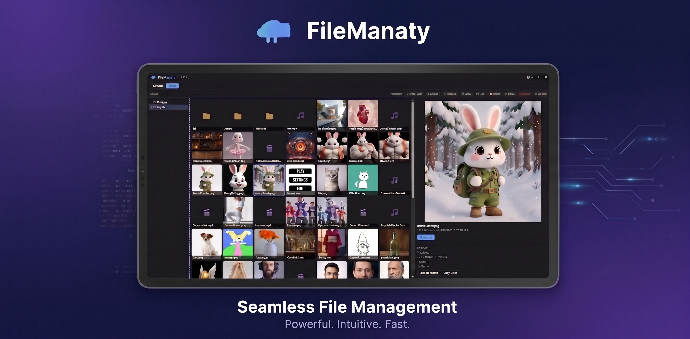

<p align="center">
  
</p>

<h1 align="center">ComfyUI-FileManaty</h1>

<p align="center">
  <strong>The gentle file-manatee for ComfyUI.</strong><br>
  A full file manager <em>inside</em> the ComfyUI web UI — browse, preview, organize,
  upload, rename, move, copy, and trash the files in your ComfyUI roots, without ever
  touching the host OS.
</p>

<p align="center">
  <a href="https://github.com/agarzon/ComfyUI-FileManaty/releases"></a>
  <a href="LICENSE"></a>
  
  <a href="https://wallrus.tech"></a>
</p>

---

## ✨ Features

- 🗂️ **Explorer-style file manager** — a folder tree, a thumbnail grid, and a live preview pane, all in one fullscreen overlay.
- 🖼️ **Rich previews** — inline images, an HTML5 **video** player, and an **audio** player. Generated files show their **resolution** (`1024 × 1024`), size, and date at a glance.
- 🧠 **See the generation behind the file** — embedded ComfyUI metadata (positive/negative prompt, seed, model, LoRAs) surfaced in the preview, with one-click **Copy JSON** and **Load on canvas** to drop the workflow straight onto your graph.
- 📤 **Full write operations** — create folders, rename, upload (button or drag from your desktop), copy/cut/paste, and move — within and across roots.
- ♻️ **Recoverable trash** — deletes go to a per-root trash you can restore from or purge. `Shift+Delete` removes permanently.
- 🛡️ **Read-only roots** — mount any root browse-only; the server rejects every write and the toolbar hides write actions.
- 🎨 **Native look & feel** — follows your active ComfyUI theme (light, dark, or custom) live, via the same design tokens ComfyUI uses.
- ⌨️ **Fast** — keyboard navigation, multi-select, drag-and-drop, right-click context menus, and `Ctrl+Shift+F` to open.
- 🔒 **Safe by design** — every path is sandboxed to your configured roots server-side (no `..`, no absolute paths, no symlink escapes).

## 📦 Installation

### Option A — ComfyUI Manager (recommended)
Open **ComfyUI Manager → Custom Nodes Manager**, search for **`FileManaty`**, click **Install**, and restart ComfyUI.

### Option B — git clone
```bash
cd ComfyUI/custom_nodes
git clone https://github.com/agarzon/ComfyUI-FileManaty.git
```
Restart ComfyUI.

> **Requirements:** Python 3.10+ and [Pillow](https://python-pillow.org/) (`>=10.0`). Pillow ships with ComfyUI, so there's usually nothing extra to install.

## 🚀 Getting started

1. Open ComfyUI in your browser.
2. Click the **🦭 FileManaty** button in the top action bar — or press **`Ctrl+Shift+F`**.
3. With no config file present, FileManaty auto-mounts ComfyUI's **`output/`**, **`input/`**, and **`workflows`** folders as your browsable roots. Start browsing!

Pick a file to preview it on the right; double-click a folder to enter it. Select one or many files (click / `Ctrl`-click / `Shift`-click / `Ctrl+A`), then use the toolbar or right-click menu to manage them.

## ⚙️ Configuration

FileManaty splits configuration into two layers.

### Display preferences — ComfyUI Settings
Open **ComfyUI Settings → 🦭 FileManaty**. These are per-browser display choices:

| Setting | What it does |
|---|---|
| **View → Allow Hidden** | Show dotfiles in listings |
| **View → Show Thumbnails** | Toggle image thumbnails |
| **View → Grid Density** | Compact / Normal / Comfortable |
| **View → Thumbnail Size** | Small / Medium / Large |
| **Sort → Field / Order** | Sort by name, size, date, or type — ascending or descending |
| **Sort → Folders First** | Keep folders above files |
| **Open → Default Root** | Which root opens first (or "Last used") |
| **Confirm → On Delete / On Shift-Delete** | Confirmation dialogs for trashing / permanent delete |

### Deployment policy — `config.json`
For security and capacity limits the server is the authority. Drop a `config.json` in the extension directory (copy `config.example.json` to start) and **restart ComfyUI** to apply.

| Field | Required | Default | Notes |
|---|---|---|---|
| `roots[]` | no | auto-mount `output/` + `input/` | The browsable roots |
| `roots[].id` | yes | — | Matches `^[a-z0-9_-]{1,32}$`, unique |
| `roots[].label` | yes | — | Display name shown in the UI |
| `roots[].path` | yes | — | **Absolute** path; must exist and be a directory |
| `roots[].writable` | no | `true` | Set `false` for a browse-only root |
| `files.image_extensions` | no | png, jpg, jpeg, webp, gif, bmp, avif | Previewed inline + get thumbnails |
| `files.video_extensions` | no | mp4, webm | Played inline (HTML5 video) |
| `files.audio_extensions` | no | mp3, wav, ogg, m4a, flac | Played inline (HTML5 audio) |
| `thumbnails.max_dimension` | no | `320` | Longest side, `64`–`1024` |
| `write.max_upload_mb` | no | `1024` | Max size per uploaded file, `1`–`1048576` |

If the config is malformed or invalid, FileManaty logs a clear error and falls back to the auto-mount defaults — **ComfyUI never crashes**.

By default, FileManaty also auto-mounts your ComfyUI **Workflows** folder
(`<user-directory>/default/workflows`) as a **writable** root, so you can browse, preview, and
manage your saved workflow `.json` files (and open them with *Load on canvas*). The folder is
created if it doesn't exist yet. A custom `config.json` replaces these auto-mount defaults, so if
you use one, add a workflows root explicitly by its path.

## 🔒 Security

FileManaty can write to your filesystem, so please read this.

- **No built-in authentication.** Anyone who can reach your ComfyUI HTTP port can use FileManaty. If you expose ComfyUI beyond localhost, put it behind a reverse proxy that handles auth (nginx basic-auth, Caddy forward-auth, Cloudflare Access, …). *(Optional built-in auth is on the roadmap.)*
- **Server-side sandboxing.** The browser only ever sends a root id + relative path. The server resolves it against the configured root and rejects `..`, absolute paths, drive switches, NUL bytes, and symlinks that escape the root.
- **Scope your roots.** Point roots at specific subdirectories — never your home directory or a system drive.
- **Safe previews.** Only images, video, and audio from your allow-lists are served inline (always with `X-Content-Type-Options: nosniff`); HTML/SVG and other active content types are refused, never rendered.

## 🗺️ Roadmap

Shipped recently: auto-mounted Workflows root, in-folder name + type filter, rich video + audio preview, embedded-metadata cards, Load-on-canvas, and a native theme-following UI. Coming next:

- 🔍 **Server-side & metadata search** — search across a whole root (past the listing cap) and find files by the **prompt / model / seed** that made them. *(In-folder name + type filtering shipped in v0.8.0.)*
- 🔐 **Optional built-in authentication** — a lightweight password mode for small deployments.
- 🖱️ **Right-click menu on the folder tree** (new folder, rename, delete, paste).
- 👁️ **Double-click to open** — full-size image lightbox, inline video/audio player, doc editor, or 3D viewer.
- 📝 **Text / JSON preview** with syntax highlighting — later, inline editing + save.
- 🧊 **3D model preview** (Load3D).
- 📤 **Send to input** — move an output into `input/` in one click.

Ideas and feedback are very welcome — open an [issue](https://github.com/agarzon/ComfyUI-FileManaty/issues).

## 🐾 The story behind the name

**FileManaty** is a small pile of puns: a **file manager** that's secretly a **manatee** 🐾, with a dash of **mana** — a little generative magic, fitting for its ComfyUI habitat. Slow, calm, and dependable is exactly how you want something looking after your files.

It comes from **Wallrus**, whose own name blends a *social **wall*** with a ***walrus***. Two friendly sea mammals, one idea: tools that are unhurried, sturdy, and easy to live with.

## 💙 Sponsored by Wallrus

FileManaty is proudly sponsored by **[Wallrus](https://wallrus.tech)**. If FileManaty makes your ComfyUI workflow nicer, go say hi. 🦭

## 🛠️ Development

```bash
python3 -m venv .venv
.venv/bin/pip install -e ".[test]"
.venv/bin/pytest -q
```

### Smoke testing with Docker
```bash
docker compose -f docker/docker-compose.yml up -d   # ComfyUI at http://localhost:8188
```
The repo is bind-mounted into the container's `custom_nodes/`. Edit on the host, then restart the container for Python changes and hard-reload the browser for JavaScript changes. Pin a ComfyUI version with `--build-arg COMFYUI_REF=v0.3.27` on `docker compose build`.

Thumbnails are cached as WebP under `<ComfyUI user dir>/filemanaty/thumbs/` — safe to delete at any time; they regenerate on demand and survive ComfyUI updates.

## 📄 License

[MIT](LICENSE) © 2026 Alexander Garzon
